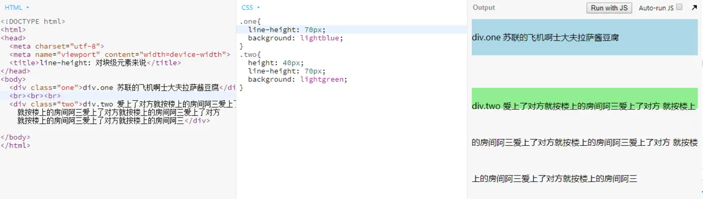

---
tags:
  - css
---
# 前端基础篇之CSS世界
我想你每天都在写css代码，有的时候也会很痛苦：这个布局的css怎么这么难实现！我也也经常会有这种感觉，一个看似简单的布局总是要琢磨半天才能实现，ouer还会出现各种怪异的超出理解的现象，这是因为我们对于css只知道个大概的形，并没有看透css的本质。推荐各位去阅读张旭鑫老师的```《css世界》```,你会更加了解css。顺便推荐个好用的在线[代码编辑工具](https://jsbin.com/?html,css,output)，国内镜像[站点](http://js.jirengu.com/?html,output)，方便各位对本文实例进行测试。
## 基本概念
这些基本概念有些可能不易理解但却都很重要，如果看完还是很不理解的话需要自己谷歌或百度，网上关于这些概念的文章不少。
### 流
“流”又叫做文档流，是css的一种基本定位和布局机制。流是html的一种抽象概念，暗喻这种排列布局方式好像流水一样自然流动。“流体布局”是html默认的布局机制，如你写的html不用css，默认自上而下(块级元素如```div```)从左到右(内联元素如```span```)堆砌的布局方式。
### 块级元素和内联元素
这个大家肯定都知道

块级元素是指单独独占一行的元素，如```div、ul、li、table、p、h1```等元素。这些元素的display默认为```block、table、list-item```等。

内联元素又叫做行内元素，指只占它对应标签的边框所包含的空间的元素，这些元素如果父元素宽度足够并排在一行显示的，如```span、a、em、i、img、td```等。这些元素的display值默认是```inline、inline-block、inline-table、table-cell```等。

实际开发中，我们经常把```display```计算值为```inline iline-block inline-table table-cell```的元素叫做内联元素，而把```display```计算值为```block```的元素叫做块级元素。

### width：auto和height:auto
```width 、height```的默认值都是```auto```。

对于内联元素，流体布局下```width：auto```自适应撑满父元素的宽度。这里的撑满并不同于```width:100%```的固定宽度，而是像水一样能够根据```margin```不同而自适应父元素的宽度。

对于内联元素，```width:auto```则呈现出包裹性，既由子元素的宽度决定。

无论内联元素还是块级元素，```height:auto```都呈现出包裹性，既高度由子元素撑开。

注意父元素```height：auto```会导致子元素```height:100%```百分比失效。

css的属性非常有意思，正常流下，如果块级元素的```width```是个固定值，```margin```是```auto```，则```margin```会撑满剩下的空间；如果```margin```是固定值，```width```是```auto```,则```width```会撑满剩下的空间。这就是流体布局的根本所在

### 盒模型（盒尺寸）
元素的内在盒子是由```margin box、border box、padding box、conent box```组成的，这四个盒子由外到内构成了盒子模型。

IE模型：```box-sizing:border-box```此模式下，元素的宽度计算为```border+padding+content```的宽度总和。

w3c标准模型：```box-sizing:content-box```此模式下，元素的宽度计算为```content```的宽度。

由于```content-box```在计算宽度的时候不包含```border padding```很烦人，而且又是默认值，业内一般采用以下代码重置：
``` css
:root {
  box-sizing: border-box;    
}
* {
  box-sizing: inherit;
}
```
## line-height和vertical-align
```line-height```和```vertical-align```是控制元素垂直对齐的两大属性，也是最难理解的属性。
### 字母x的角色
在内联元素的垂直方向对其中，基线是最重要的概念。```line-height```定义的就是两基线之间的距离，```vertical-align```的默认值就是基线。基线的定义则是字母x的下边缘。

css中有个概念叫```x-height```，指的是小写字母x的高度。```vertical-align:middle```对齐的就是基线往上1/2x-height的高度的地方，可以理解为近似字母x的交叉点。

css中除了```px/em/rem```等，还有个单位是```ex```。指的是小写字母x的高度，既```x-height```。用处不大。
### line-height
- ```line-height```各属性值

```normal```:默认值，其实是类型为数值的变量，根据浏览器和字体'font-family'不同而不同，一般为1.2.

数值和百分比：最终会被计算为带单位的值，具体计算方式就是乘以字体大小。

长度值：就是```100px```这样带单位的值。

- ```line-height```的作用：

```line-height```属性用于设置多行元素的空间量，如多行文本的间距。

对于块级元素来说，```line-height```决定了行框盒子的最小高度。注意是行框盒子的最小高度，而不是块级元素的实际高度。(图中两个```div```行高一样，```div.one```的背景色区域就是行框盒子的高度，而```div.two```的背景区域则是实际高度，其行框盒子高度和```div.one```是一样的。)



