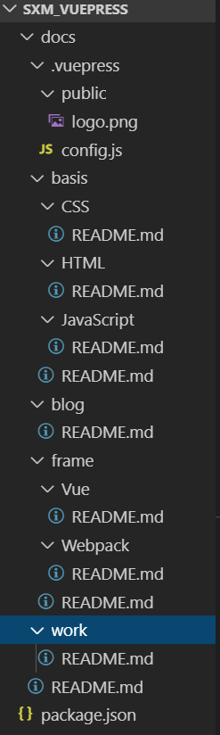
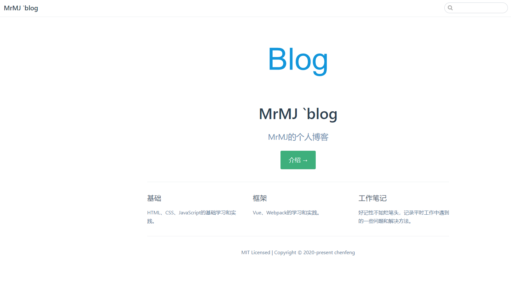
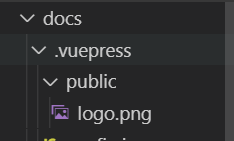
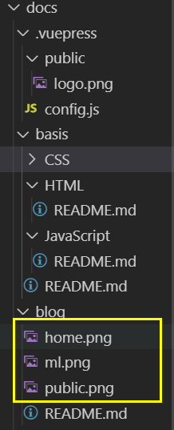
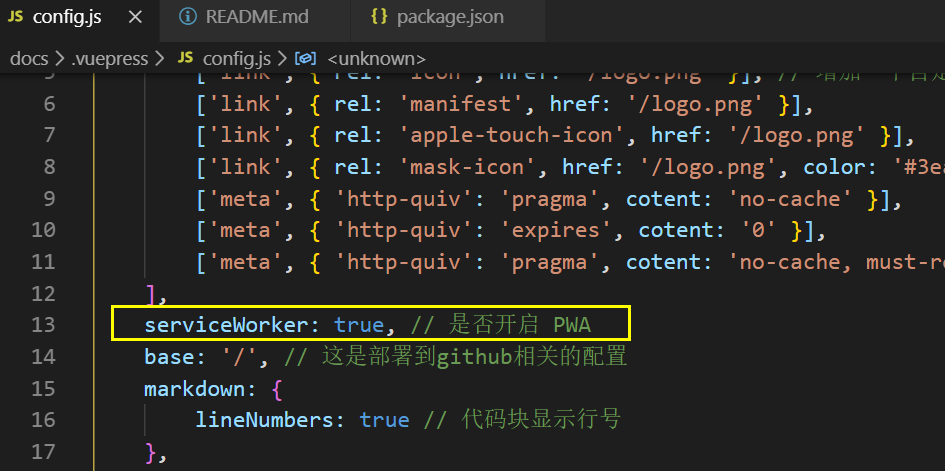
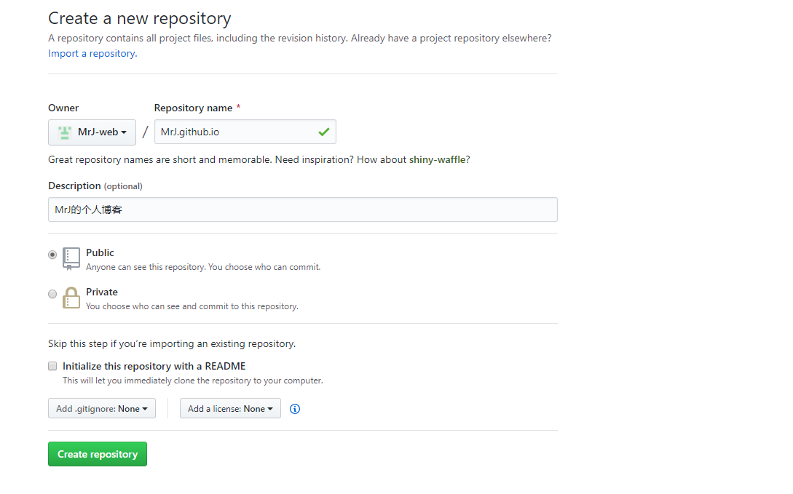
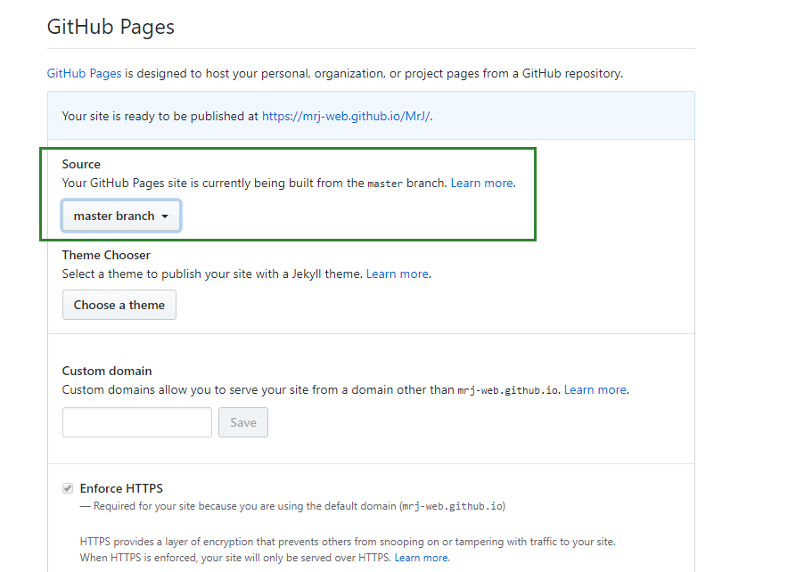
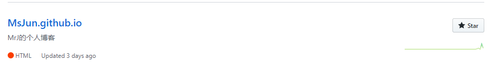
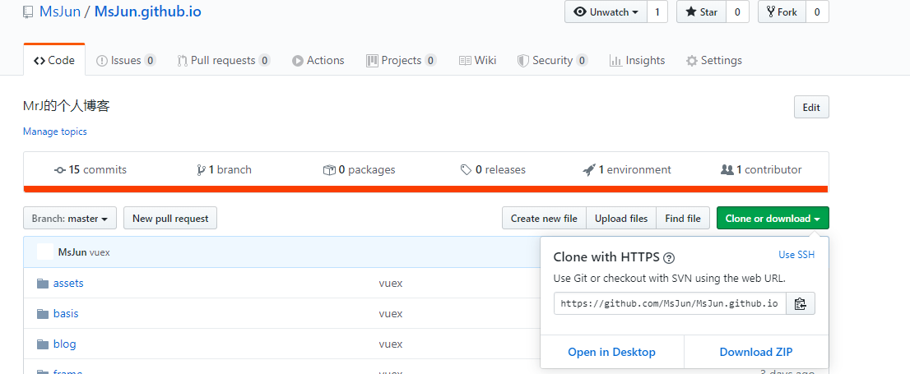
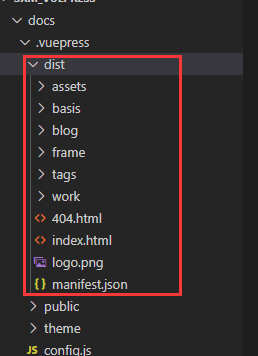

---
tags:
  - blog
  - vuepress
---
# 关于博客
这个博客是基于Vuepress1.X来搭建的。记录一些技术方面的知识。下面是介绍怎么用Vuepress从头开始搭建一个技术博客。
## Vuperss简介
[Vuepress](https://v1.vuepress.vuejs.org/zh/)是Vue生态中关于静态网站的一个生成器，对于技术类型博客支持很好，配置少，上手快，UI风格讨人喜欢。这个博客网站使用的是Vuepress1.x来进行搭建的。除了这个博客之外下面的网站也是使用的vuepress
- [Vuepress](https://v1.vuepress.vuejs.org/)
- [Vue](https://cn.vuejs.org/index.html)
## 起步
- 默认你的电脑上有[Node](https://nodejs.org/zh-cn/)环境
- Node.js的版本大于8.6
- 如果已经阅读过官方文档最好不过
## 安装vuepress
在这个博客使用的是vuepress1.X所以安装的时候需要这样安装：

``` javascript 
yarn global add vuepress@next // OR npm install -g vuepress@next //全局安装
```
如果想要使用vuepress0.X,按照下面的安装方式，
``` javascript
 yarn global add vuepress // OR npm install -g vuepress
```
对于新手搭建博客这两个版本的区别不大，这个博客中建议使用vuepress1.X。
## 搭建博客项目
一共分为四个部分

- 搭建一个初始项目并且能用vuepress来写博客
- 配置导航和侧边栏
- 构建并且发布
- 自动化部署
开始之前我先放一个我的博客的目录结构：


## 第一部分：搭建项目
新建自己的文件夹,并且初始化项目,在第一部分中
``` sh
mkdir writ-blog
cd writ-blog
npm init -y
mkdir docs // 这个文件夹是放置所有博客的地方
cd docs
touch README.md //创建reademe文件，即首页
```
初始化的目录结构如下所示：
``` vue
.
├─ docs
│  └─ README.md
└─ package.json
```
::: warning 注意
docs文件名称默认不可修改  
docs文件夹是你所有博客所在的文件夹，docs文件夹根目录下的README.md 文件在经过vuepress的编译之后会成为你的博客网站的首页！！！
:::
在docs跟目录中的README.md文件中写上以下内容：
``` yaml
---
home: true
heroImage: /logo.png
actionText: 介绍 →
actionLink: /blog/
features:
- title: 基础
  details: HTML、CSS、JavaScript的基础学习和实践。
- title: 框架
  details: Vue、Webpack的学习和实践。
- title: 工作笔记
  details: 好记性不如烂笔头，记录平时工作中遇到的一些问题和解决方法。
footer: MIT Licensed | Copyright © 2020-present chenfeng
---
```
::: warning 注意
这个文件就是你博客的首页(index.html)，'home: true',是必须的
:::
初始化之后，在package.json中的script中添加两个命令：
``` javascript
"dev": "vuepress dev docs",
"build": "vuepress build docs",
```
然后执行npm run dev，在浏览器中打开服务,会出现一个页面，大概长得是这个样子


到这里第一步就已经完成了，你已经可以写博客了，但是远远不能满足咱们的需求，这个时候就需要配置导航和侧边栏了。
## 第二部分：配置导航和侧边栏
第二部分的目录结构如下：
``` vue
.
├─ .vuepress
│  └─ config.js
├─ docs
│  └─ README.md
└─ package.json
```
你会注意到这一步多出了一个.vuepres的文件夹，有关vuepress的配置，都在这个文件夹之中，下面介绍一下有关导航栏和侧边栏的配置。.vuepress/config中的基本配置如下：
``` javascript
module.exports = {
    title: 'MrMJ `blog',
    description: 'MrMJ的个人博客',
}
```
当你完成上述步骤的话，你在本地起的dev环境所呈现的网页应该包含一个页头,和一个描述。
下面这个配置内容是我的网站的配置：
``` javascript
module.exports = {
    title: 'MrMJ `blog', //标题
    description: 'MrMJ的个人博客',//网站描述
    head: [ // 注入到当前页面的 HTML <head> 中的标签
        ['link', { rel: 'icon', href: '/logo.png' }], // 增加一个自定义的 favicon(网页标签的图标)
        ['link', { rel: 'manifest', href: '/logo.png' }],
        ['link', { rel: 'apple-touch-icon', href: '/logo.png' }],
        ['link', { rel: 'mask-icon', href: '/logo.png', color: '#3eaf7c' }],
        ['meta', { 'http-quiv': 'pragma', cotent: 'no-cache' }],
        ['meta', { 'http-quiv': 'expires', cotent: '0' }],
        ['meta', { 'http-quiv': 'pragma', cotent: 'no-cache, must-revalidate' }]
    ],
    serviceWorker: true, // 是否开启 PWA
    base: '/', // 这是部署到github相关的配置
    markdown: {
        lineNumbers: true // 代码块显示行号
    },
    themeConfig: {
        sidebar: 'auto',//侧边栏自动匹配标题
        search: true,//搜索
        searchMaxSuggestions: 10,
        nav: [
            { text: '主页', link: '/' },
            {
                text: '基础', items: [
                    { text: 'JavaScript', link: '/basis/JavaScript/' },
                    { text: 'HTML', link: '/basis/HTML/' },
                    { text: 'CSS', link: '/basis/CSS/' },
                ]
            },
            {
                text: '框架', items: [
                    { text: 'Vue', link: '/frame/Vue/' },
                    { text: 'Webpack', link: '/frame/Webpack/' },
                ]
            },
            { text: '工作笔记', link: '/work/' },
        ],
        sidebarDepth: 2, // 侧边栏显示2级
    },
    port:8082,//端口
    
};
```
这个时候的导航还是不能工作的，因为你会找不到路径。所以需要把导航对应的文件夹都建立好，这些文件夹都是建立在docs的跟目录中的，博客每个页面对应的文件都是在docs的跟目录下的！！！这些文件夹建立好之后，都要创建一个README.md的文件，因为当你的路径只写文件夹的时候，这个文件在vuepress中是路径默认匹配的。我的docs的文件目录如下：


这个时候运行项目,每一个导航栏对应的页面应该时空白页面。

关于docs/.vuepress/public这个文件夹:是存放公共的资源的，我把我博客的logo放到了这个文件夹中



每篇博客的静态资源建议放到该篇博客的目录下而不是都放到public之中。例如：本片教程中的图片我都放到了这篇文章对应的目录下面:



关于pwa的manifest配置也是需要放到这个文件夹中的。 manifest.json的内容：
``` javascript 
{
    "name": "MrMJ",
    "short_name": "Jun",
    "start_url": "index.html",
    "display": "standalone",
    "background_color": "#2196f3",
    "description": "个人网站",
    "theme_color": "blue",
    "icons": [
      {
        "src": "./logo.jpg",
        "sizes": "144x144",
        "type": "image/png"
      }
    ],
    "related_applications": [
      {
        "platform": "web"
      },
      {
        "platform": "play",
        "url": "https://play.google.com/store/apps/details?id=cheeaun.hackerweb"
      }
    ]
  }

```
#### serviceWorker
- 类型: boolean
- 默认值: true  


如果设置为 true，VuePress 将自动生成并注册一个 [Service Worker](https://developers.google.com/web/fundamentals/primers/service-workers/)，用于缓存页面的内容以供离线使用（仅会在生产环境中启用）。
::: tip 提示
只有在你能够使用 SSL 部署您的站点时才能启用此功能，因为 service worker 只能在 HTTPs 的 URL 下注册。
:::
到此为止，第二部分就完毕了。
## 第三部分:构建并且发布
在这个部分中你需要在github上新建一个{youName}.github.io的项目，我的项目是[项目](https://msjun.github.io/)


这个项目就是所谓的GitHub Pages，新建好项目之后需要在该项目的setings中设置GitHub Pages



设置好之后你的博客路径就是```https://YourName.github.io```
### 发布
Github仓库创建完成后，将仓库```clone```到本地




将本地写好的代码进行```build```打包，会在```.vuepress```文件夹下生成dist目录，将其中的所有文件放入```clone```下来的仓库中


### 最后
提交远程仓库就可以了
```javascript
git pull//拉取远程仓库更新本地代码
git status//查看状态和是否存在.git文件
git add .//将本地代码添加进暂存区
git commit -m '注释'//提交到版本库
git push//push到远程仓库
```