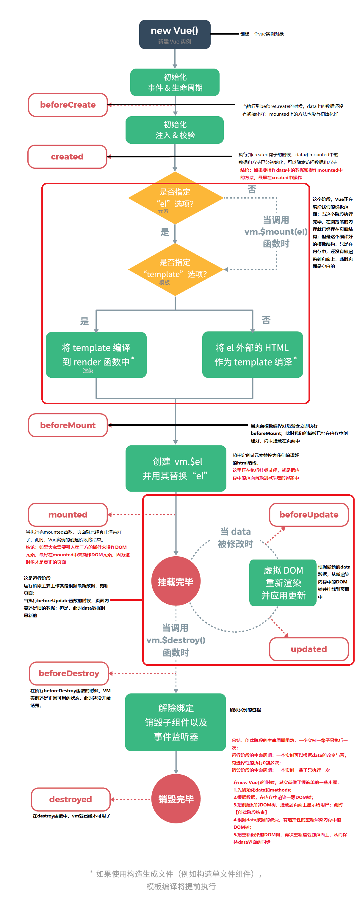
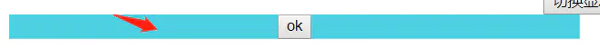

---
tags:
  - vue
---
# 基础
## 1.MVVM的理解
MVC 
::: tip MVC
model+view+controller 用户操作会请求服务端路由，路由会调用对应的控制器来处理，控制器会获取数据，将结果返回给前端，页面从新渲染
:::
MVVM
::: tip MVVM
mode+view+viewmodel传统的前端会将数据手动渲染到页面中，```MVVM```模式不需要用户收到操作```dom```元素，将数据绑定到```viewModel```层上，会自动将数据渲染到页面中，视图变化会通知```viewModel层```更新数据。```ViewModel```就是我们```MVVM```模式中的桥梁。
:::
## 2.Vue理解
vue
::: tip vue
渐进式框架，是一种自底而上的增量开发设计 渐进性
在声明式渲染(模板视图渲染)的基础上，可以通过增加组件系统(components)，路由(vue-router)，状态管理(vuex)来构建一个完整的框架
声明式渲染和组件库是Vue的核心内容，而数据状态管理、路由、架构工具都是有专门的独立方案解决
'渐进式'是vue的实现方式，也是他的设计理念
:::
## 3.响应式数据原理
::: tip 响应式数据原理
调用new objserver的defaultReact通过递归给对象的每一个属性添加Object.definePropetty,并创建dep实例保存相关依赖
Dep实例保存一个sub数组，保存的依赖添加到数组中，更新依赖调用数组中的updata方法
依赖是watch实例，保存了数据变化时需要更新的操作，并且将自己放入全局中，读取数据时，触发数据的get，将自身收集到dep数组中
:::
## 4.computed特点
- 会有缓存，当依赖发生变化时，采取更新视图
## 5.computed和methods和watch区别
### computed
- 执行时，只执行直接调用的变量
- 有缓存，如果数据不进行更新，则不会从新触发计算，conger节约性能
- 不便于操作异步
- 默认不会先执行
- 是计算一个新属性，并将该属性挂载到vm(Vue实例)上
- 本质是一个惰性求值的观察者，具有缓存性，只有当依赖变化后第一次访问computed属性，才会计算新的值
- 适用于一个数据被多个数据影响
::: tip 说明：
计算属性是基于它们的依赖进行缓存的，只有在它的依赖发生改变时才会重新求值
注意：Mustache语法（```{{}}```）中不要放入太多的逻辑，否则会让模板过重、难以理解和维护
注意：```computed```中的属性不能与```data```中的属性同名，否则会报错
:::
```javascript
var vm = new Vue({
  el: '#app',
  data: {
    firstname: 'jack',
    lastname: 'rose'
  },
  computed: {
    fullname() {
      return this.firstname + '.' + this.lastname
    }
  }
})
```
### methods
- 无缓存，每次都会从新计算
- 视图更新时都会从新计算

### watch(一方改变，另一方跟着改变)
代码复用性高
便于处理异步
混合使用
watch会先执行
watch是监听已经存在且已经挂载到vm上的数据，所以用watch同样可以监听computend计算属性的变化(其他还有data、props)
watch则是当数据发生变化便会调用执行函数
watch适用于一个数据影响多个数据
``` javascript
new Vue({
  data: { a: 1, b: { age: 10 } },
  watch: {
    a: function(val, oldVal) {
      // val 表示当前值
      // oldVal 表示旧值
      console.log('当前值为：' + val, '旧值为：' + oldVal)
    },
    // 监听对象属性的变化
    b: {
      handler: function (val, oldVal) { /* ... */ },
      // deep : true表示是否监听对象内部属性值的变化 
      deep: true
    },
    // 只监视user对象中age属性的变化
    'user.age': function (val, oldVal) {
    },
  }
})
```
## 6.生命周期
#### 每个生命周期的用途
```beforeCreate```
在实例初始化之后，数据观测(data observer)之前调用

```created```
实例已经创建完成后调用，在这一步，实例已经完成以下配置：
- 数据观测(observer)
- 属性和方法的运算
- watch/event时间回调
这里没有```$el```

```beforeMount```
在挂载之前被调用，相关的render首次被调用

```mounted```
```el```被创建的```vm.$el```所替代，并挂载到实例上去后调用

```beforeUpdate```
数据更新时调用，发生的虚拟DOM重现渲染和打补丁之前

```updated```
由于数据更改导致虚拟DOM重新渲染和打补丁，在这之后会调用该钩子

```beforeDestroy```
实例销毁之前调用，在这一步，实例还可以完全使用

```destroy```
```Vue```实例销毁后调用。调用后，```Vue```实例指示的所有东西都会解绑，所有的事件监听器都会被移除，所有的子实例也会被销毁，该钩子在服务器端渲染期间不会被调用。

### 每个生命周期需要做的事情
```created```
实例已经创建完成，可以进行一些数据和资源的请求

```mounted```
实例已经创建完成，可以操作DOM

```beforeUpdate```
可以在这个钩子中进一步的更改状态，这不会触发附加的重渲染过程。

```update```
可以执行依赖于DOM的操作。然而在大多数情况下，你应该避免在此期间更改状态，因为这可能会导致更新无线循环。该钩子在服务器端渲染期间不会执行

```destroyed```
可以执行一些优化操作，清空定时器，接触绑定事件


## 7.模板语法
Vue提供了一堆数据绑定语法。
- 文本插值
``` html
 {{ text }}
 ```
- ````<div v-html="html"></div>````html输出
- v-bind html属性差值。如```<button v-bind:disabled="someDynamicCondition">Button</button>```
- javascript表达式，直接在mustache、属性插值里面使用各种表达式(如+-x%、三元运算、方法调用等)。
- 过滤器(有点类似SHELL命令中的管道，可以定义过滤器来对原始值就行变化).
- 指令，之前提到的v-bind也是一种指令，其他包括v-on:系列(dom事件的监听)、v-for、v-model等。
- v-cloak 和css规则如[v-cloak]{display:none}一起用，可以隐藏未编译的Mustache标签直到实例准备完毕
### 绑定不同class
```html
v-bind:class="{'act':isact,'font':isact}"<!--v-bind:属性名=“表达式”，最终表达式运算结果赋值给该属性名-->
```
### vue常用修饰符及作用
1.事件修饰符
- .stop阻止事件冒泡
- .prevent用于阻止事件的默认行为，例如，当点击提交按钮时阻止对表单的提交。相当于调用了event.preventDefault()方法。
```html
<!-- 提交事件不再重载页面 -->
<form v-on:submit.prevent="onSubmit"></form>
```
::: warning 注意：
修饰符可以同时使用多个,但是可能会因为顺序而有所不同。
用 v-on:click.prevent.self 会阻止所有的点击，而 v-on:click.self.prevent 只会阻止对元素自身的点击。
也就是从左往右判断~
:::
- .self只当事件是从事件绑定的元素本身触发时才触发回调。像下面所示，刚刚我们从.stop时候知道子元素会冒泡到父元素导致触发父元素的点击事件，当我们加了这个.self以后，我们点击button不会触发父元素的点击事件shout，只有当点击到父元素的时候（蓝色背景）才会shout~从这个self的英文翻译过来就是‘自己，本身’可以看出这个修饰符的用法
```html
<div class="blue" @click.self="shout(2)">
  <button @click="shout(1)">ok</button>
</div>
```

- .once这个修饰符的用法也是和名字一样简单粗暴，只能用一次，绑定了事件以后只能触发一次，第二次就不会触发。
```html
<!--键盘按坏都只能shout一次-->
<button @click.once="shout(1)">ok</button>
```
- .native将一个vue组件变成一个普通的html，使其可以监听click等原生事件，具体使用如下：
```html
<!--<Tag @click.native="handClick">ok</Tag>-->

<!DOCTYPE html>
<html>
<head>
<meta charset="utf-8">
<title>Vue 测试实例</title>
<script src="https://unpkg.com/vue/dist/vue.js"></script>
</head>
<body>
<div id="app">
  <p>{{ message }}</p>
	<h1>{{form.title}}</h1>
	<button @click="changeMessage">切换</button>
	<br/>
	<cpn @click.native="clickCpn"></cpn>
</div>
<template id="cpn">
	<div>
		<button @click="clickCpn1">组件点击事件1</button>
		<button @click="clickCpn2">组件点击事件2</button>
	</div>
</template>
<script>
let cpn = {
	template: '#cpn',
	methods:{
		clickCpn1(){
			console.log("child1 click event");
			//this.$emit('click');
		},
		clickCpn2(){
			console.log("child2 click event");
			//this.$emit('click');
		}
	}
}
var app = new Vue({
  el: '#app',
  data: {
    message: 'Hello Vue.js!',
	 form:{
	 	title: "标题党"
	 }
  },
  components:{
  	cpn,
  },
  watch: {
  	'form.title'(newVal, oldVal){
		console.log(newVal + ' -- ' + oldVal);
	}
  },
  methods: {
  	changeMessage(){
		this.form.title = 'helloworld'
	},
	clickCpn(){
		console.log("parent click event");
	}
  }
})
</script>
</body>
</html>
```
### 表单修饰符
- .lazy在输入框输入完内容，光标离开时才更新视图
```html
<div>
   <input type="text" v-model.lazy="value">
   <p>{{value}}</p>
</div>
```
- .trim过滤首位空格
```html
<!--在我们的输入框中，我们经常需要过滤一下一些输入完密码不小心多敲了一下空格的兄弟输入的内容。-->
<input type="text" v-model.trim="value">
```
- .number如果先输入数字，那他就会限制你输入的只能是数字；如果先输入字符串，那就相当于没有加.number
- .stop由于事件冒泡的机制，我们给元素绑定点击事件的时候，也会触发父级的点击事件
```html
<div @click="shout(2)">
  <button @click="shout(1)">ok</button>
</div>

<!--js
shout(e){
  console.log(e)
}
//1
//2
一键阻止事件冒泡，简直方便得不行。相当于调用了event.stopPropagation()方法。-->
<div @click="shout(2)">
  <button @click.stop="shout(1)">ok</button>
</div>
<!--只输出1-->
```
- .capture
从上面我们知道了事件的冒泡，其实完整的事件机制是：捕获阶段--目标阶段--冒泡阶段。
默认的呢，是事件触发是从目标开始往上冒泡。
当我们加了这个.capture以后呢，我们就反过来了，事件触发从包含这个元素的顶层开始往下触发。
```html
<div @click.capture="shout(1)">
      obj1
      <div @click.capture="shout(2)">
        obj2
        <div @click="shout(3)">
          obj3
          <div @click="shout(4)">
            obj4
          </div>
        </div>
      </div>
    </div>
    <!-- 1 2 4 3 -->
```
从上面这个例子我们点击obj4的时候，就可以清楚地看出区别，obj1，obj2在捕获阶段就触发了事件，因此是先1后2，后面的obj3，obj4是默认的冒泡阶段触发，因此是先4然后冒泡到3~
### 鼠标按钮修饰符
刚刚我们讲到这个click事件，我们一般是会用左键触发，有时候我们需要更改右键菜单啥的，就需要用到右键点击或者中间键点击，这个时候就要用到鼠标按钮修饰符

- .left 左键点击
- .right 右键点击
- .middle 中键点击
```html
<button @click.right="shout(1)">ok</button>
```
### 键值修饰符
其实这个也算是事件修饰符的一种，因为它都是用来修饰键盘事件的。比如onkeyup，onkeydown啊
- .keyCode
如果不用keyCode修饰符，那我们每次按下键盘都会触发shout，当我们想指定按下某一个键才触发这个shout的时候，这个修饰符就有用了，具体键码查看[键码对应表](https://zhidao.baidu.com/question/266291349.html)
```html
<input type="text" @keyup.keyCode="shout(4)">
```
为了方便我们使用，vue给一些常用的键提供了别名
```
//普通键
.enter 
.tab
.delete //(捕获“删除”和“退格”键)
.space
.esc
.up
.down
.left
.right

//系统修饰键
.ctrl
.alt
.meta
.shift
```
可以通过全局 config.keyCodes 对象自定义按键修饰符别名：
```
// 可以使用 `v-on:keyup.f1`
Vue.config.keyCodes.f1 = 112
```
我们从上面看到，键分成了普通常用的键和系统修饰键，区别是什么呢？
当我们写如下代码的时候,我们会发现如果仅仅使用系统修饰键是无法触发keyup事件的。
```html
<input type="text" @keyup.ctrl="shout(4)">
```
那该如何呢？我们需要将系统修饰键和其他键码链接起来使用，比如
```html
<input type="text" @keyup.ctrl.67="shout(4)">
```
这样当我们同时按下ctrl+c时，就会触发keyup事件。另，如果是鼠标事件，那就可以单独使用系统修饰符。
```html
<button @mouseover.ctrl="shout(1)">ok</button>
<button @mousedown.ctrl="shout(1)">ok</button>
<button @click.ctrl.67="shout(1)">ok</button>
```
大概是什么意思呢，就是你不能单手指使用系统修饰键的修饰符（最少两个手指，可以多个）。你可以一个手指按住系统修饰键一个手指按住另外一个键来实现键盘事件。也可以用一个手指按住系统修饰键，另一只手按住鼠标来实现鼠标事件。

## 8.过滤器 filter
- 作用：文本数据格式化
- 过滤器可以用在两个地方：```{{}}```和v-bind表达式
- 两种过滤器：1.全局过滤器2.局部过滤器

### 全局过滤器
- 说明：通过全局方式创建的过滤器，在任何一个Vue实例中都可以使用
- 注意：使用全局过滤器的时候，需要先创建全局过滤器，在创建Vue实例
- 显示的内容由过滤器的返回值决定
```javascript
Vue.filter('filterName',function(value){
	//value表示要过滤的内容
})
```
- 示例：
``` javascript
<div>{{ dateStr | date }}</div>
<div>{{ dateStr | date('YYYY-MM-DD hh:mm:ss') }}</div>

<script>
  Vue.filter('date', function(value, format) {
    // value 要过滤的字符串内容，比如：dateStr
    // format 过滤器的参数，比如：'YYYY-MM-DD hh:mm:ss'
  })
</script>
```
### 局部过滤器
- 说明：局部过滤器是在某一个vue实例的内容创建的，只在当前实例中起作用
``` javascript
filters:{ 
        NumFormat:function(value){
           if(value > 10000){
                value = Math.ceil(value/10000);
           }
           return value;
        }
    }
```
## axios
- Promise based HTTP client for the browser and node.js
	- 以Promise为基础的HTTP客户端，适用于：浏览器和node.js
	- 封装ajax，用来发送请求，异步获取数据
- 安装：```npm install -S axios```
- [axios](https://github.com/axios/axios)
```javascript
//在浏览器中使用，直接引入js文件使用下面的GET/POST请求即可
//1.引入axios.js
//2.直接调用axios提供的API发送请求
created:funxtion(){
	axios.get(url,pram)
	.then(function(resp){})
}

---
//配合webpack使用方式如下：
import Vue from 'vue'
import axios from 'axios'
//将axios添加到Vue.prototype中
Vue.prototype.$axios = axios

---
//在组件中使用
methods:{
	getData(){
		this.$axios.get('url')
		.then(res =>{})
		.catch(err =>{})
	}
}

---
//API使用方式：
axios.get(url,[config])
axios.post(url,[data[config]])
axios(url,[config])
axios(config)
```
### Get 请求
```javascript
const url = 'http://vue.studyit.io/api/getnewslist'

//url中带有query参数
axios.get('/user?id=89')
.then((data) => {
	console.log(data);
})
.catch((err) => {
	console.log(err)
})

//url和参数分离，使用对象
axios.get('/user',{
	params:{
		id:12345
	}
})
```
### Post 请求
- 不同环境中处理POST请求
- 默认情况下，axios会将JS对象序列化为JSON对象，为了使用```application/x-www-form-urlencoded``` 格式发送请求，我们可以这样：
```javascript
// 使用 qs 包，处理将对象序列化为字符串
// npm i -S qs
// var qs = require('qs')
import qs from 'qs'
qs.stringify({ 'bar': 123 }) ===> "bar=123"
axios.post('/foo', qs.stringify({ 'bar': 123 }))

// 或者：
axios.post('/foo', 'bar=123&age=19')
```

```javascript
const url = 'http://vue.studyit.io/api/postcomment/17'
axios.post(url, 'content=点个赞不过份')

axios.post('/user', qs.stringify({
    firstName: 'Fred',
    lastName: 'Flintstone'
  }))
  .then(function (response) {
    console.log(response);
  })
  .catch(function (error) {
    console.log(error);
  });
```
### 全局配置
```javascript
// 设置请求公共路径：
axios.defaults.baseURL = 'http://vue.studyit.io'
```


### 父子组件传值


### 7.v-if和v-show的区别
```v-show```只是切换当前DOM的```dasplay```

```v-if```如果条件不成立不会渲染当前指令所在节点的```dom```元素

### 8.v-for和v-if
```v-for```比```v-if```的优先级要高，如果连用，给每个属性都添加，造成资源浪费