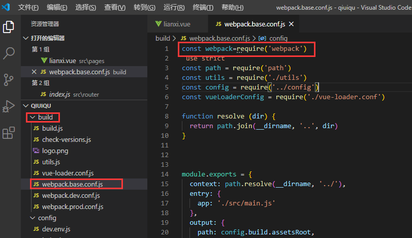
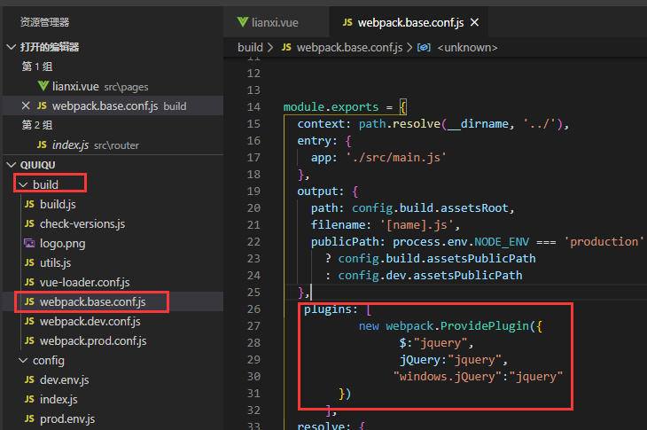
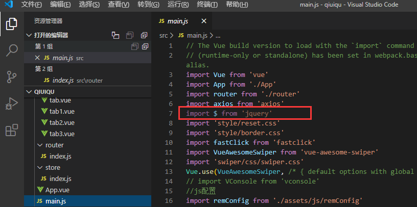

---
tags:
  - vue
  - 插件
---
## jQuery
jQuery 是一个高效、精简并且功能丰富的 JavaScript 工具库。它提供的 API 易于使用且兼容众多浏览器，这让诸如 HTML 文档遍历和操作、事件处理、动画和 Ajax 操作更加简单。
```html
<script src="https://cdn.bootcdn.net/ajax/libs/jquery/3.5.1/jquery.js"></script>
```
## vue引入jQuery
::: tip 说明 
如果想在普通的HTML页面引入jQuer库的话，直接使用```<script src="jQuery.js"></script>```即可。但是如果要在Vue组件中使用jQuery库的话，使用这样的方式就不行了，需要使用以下方法
:::
### 一、安装jQuery依赖
在使用jQuery之前，我们首先要通过以下命令来安装jQuery依赖：
```
npm install jquery --sava

# 如果你更换了淘宝镜像，可以使用cnpm来安装，速度更快
cnpm install jquery --save
```
### 二、修改配置文件
安装完jQuery依赖之后，要修改webpack.base.config文件。注意Vue版本是2.x，如果你是用的是Vue3.x的话，就要找一找文件位置。

首先添加一行代码，引入webpack
```javascript
const webpack = require('webpack')
```


其次是在下图位置，添加代码配置jQuery插件

```javascript
plugins: [ 
   new webpack.ProvidePlugin({ 
       $:"jquery", 
        jQuery:"jquery", 
        "windows.jQuery":"jquery"
   }) 
], 
```

### 三、在组件中引入jQuery，进行使用
::: tip 说明
我们想在哪个组件中使用jQuery库，首先要使用如下命令引入jquery，然后就可以正常使用了

也可以在main.js中全局引入
:::
```javascript
import $ from 'jquery'
```
