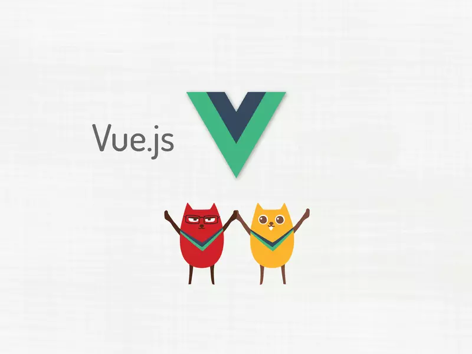

---
tags:
  - vue
---

学习一个新技术，必须要清楚两个W，'What && Why'.
'XX 是什么？'，'为什么要使用XX，或者说XX有什么好处'，最后才是'XX'怎么使用。

## Vuex是什么？
Vuex类似Redux的状态管理器，用来管理Vue的所有组件状态。
### 为什么使用Vuex？
当你打算开发大型单页面应用(SPA),会出现多个视图组件依赖同一个状态，来自不同视图的行为需要变更同一个状态。
遇到以上情况时候，你应该考虑使用Vuex了，他能把组件的共享状态抽取出来，当做一个全局单例模式进行管理。这样不管你在何处改变状态，都会通知使用该状态的组件做出相应修改。
### 最简单的Vuex示例
```javascript
import Vue from 'vue';
import Vuex from 'vuex';
Vue.use(Vuex);

const store = new Vuex.Store({
    state:{
        count:0
    },
    mutations:{
        increment(state){
            state.count++
        }
    }
})
```
以上就是一个简单的Vuex，每个Vuex应用就是一个Store，在store中包含组件中的共享状态```state```和改变状态的方法```mutations```。

需要注意的是只能通过```mutations```改变store的```state```的状态，不能通过```store.state.count = 5;```直接更改，```state```相当于对外的只读属性。

使用```store.commit```方法触发```mutations```改变```state```:
```javascript
store.commit('increment');
console.log(store.state.count) // 1
```

一个简简单单的Vuex应用就实现了。
### 在Vue组件使用Vuex
如果希望Vuex状态更新，相应的Vue组件也得到更新，最简单的方法就是在Vue的```computed```(计算属性)获取```state```
```javascript
//counter组件
const Counter = {
    template:`<div>{{ count }}</div>`，
    computed：{
        count () {
            return store.state.count;
        }
    }
}
```

